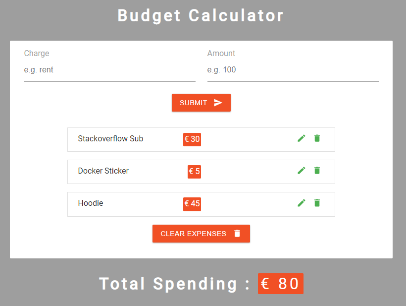

## What is this project
A little web project to train my React skills, it's a simple budget calculator that can:
- Add an expense
- Edit an expense
- Delete an expense
- Store the edit in local browser storage with the API **localstorage**
 

## **[LIVE DEMO](https://react-budget-calculator-edonadei.netlify.com/)**

## Prerequisites
- Node.Js to run everything
- Git SCM to clone the repo

# How to install and run
### `git clone git@github.com:edonadei/react-budget-calculator.git`

Clone the code from this repo. 
At this point, you only have the sources, you will have to install the libraries.

### `npm install`

Install all the node modules. 
If you want to fork, the .git ignore already ignore everything.

### `npm start`

Runs the app in the development mode. 
Open [http://localhost:3000](http://localhost:3000) to view it in the browser.

The page will reload if you make edits. 
You will also see any lint errors in the console.
